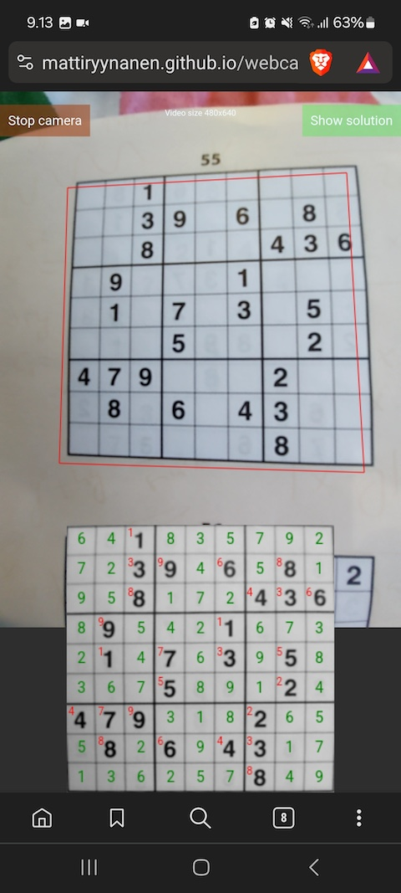

# Introduction

My name is Matti Ryynänen and I am Doctor of Science (Tech.) in signal processing. I have 15+ years of experience in algorithm and software development, machine learning applications, and gaming industry on various platforms (mobile devices, web, gaming consoles).

For more detailed information on my work career, please see my LinkedIn [profile](https://www.linkedin.com/in/mattiryynanen/).

# Projects

This is a short collection of projects which I have worked for fun on my free time. The purpose of these projects is to try out various technologies and learn on the go.

#### [Sudoku detector](webcam-sudoku/index.html) from web camera

* Detection is running and updating in real-time on browsers, including mobile devices.
* Try the detector on your browser [here](webcam-sudoku/index.html). Start the camera and point it to a Sudoku puzzle, for example, on your newspaper.
* Image processing, including Sudoku placement detection, blurring, and warping written in TypeScript.
* Digit recognition neural network trained with a small, custom-collected dataset with Keras / Tensorflow in python.
* Real-time digit recognition inference is done **in browser on the device** with tensorflow.js

An example of the Sudoku detector running on a mobile phone browser.

* The red rectangular area shows the detected Sudoku puzzle from the web camera image.
* The lower part shows the warped and segmented Sudoku puzzle with inferred digits with red and the numbers solving the puzzle with green.

#### Shortest path finding with A* or Dijkstra ([demo](a-star-vs-dijkstra/index.html))

* The A* and Dijkstra algorithm for the shortest path finding implemented in C++.
* Converted to [WebAssembly](https://webassembly.org/) with [Emscripten](https://emscripten.org/) toolchain.
* A humble 2D visualization implemented with [SDL2](https://www.libsdl.org/).
* Try it in your browser [here](a-star-vs-dijkstra/index.html)

#### Drum chop tool

I enjoy playing drums (and guitar, too) a lot so I implemented a small rehearsal tool for myself to explore drum chops and polyrhythmic sequences in a web browser.

Try it out on your browser [here](drum-chops/index.html).

* Written in TypeScript with React
* Using [tone.js](https://tonejs.github.io/) for sound synthesis

#### Step-by-step [Sudoku solver](scala-sudoku/index.html)

* Written in Scala and running on web via [scala.js](https://www.scala-js.org/)
* Shows individual steps for the solution.
* Try it out [here](scala-sudoku/index.html)

#### Haskell Sudoku step-by-step solver

I enjoy utilising functional programming concepts so I wrote a small command-line application for Sudoku puzzle solving using Haskell (a purely functional programming language).

* The source code is available on my GitHub [repository](https://github.com/MattiRyynanen/haskell-sudoku)
* Using [QuickCheck](https://hackage.haskell.org/package/QuickCheck) for property-based testing
* Using [doctest](https://hackage.haskell.org/package/doctest) for interactive testing

# Research

My old research demo pages, PhD thesis, and publications can be found [here](research/research.html).